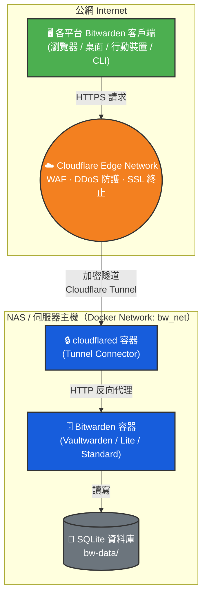
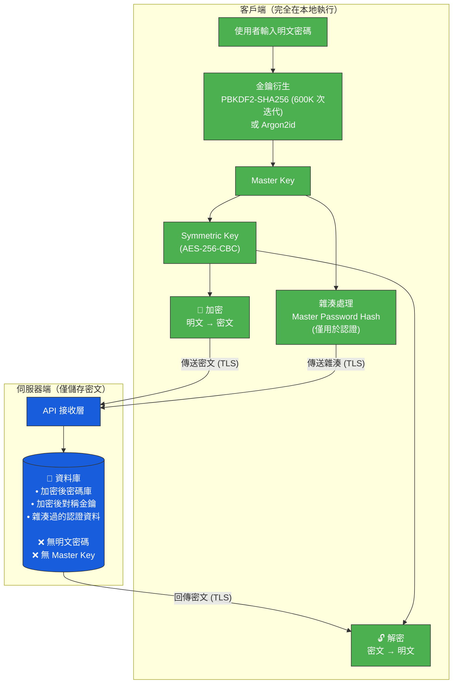

# Bitwarden 自建伺服器部署專案

透過 Docker Compose 搭配 [Cloudflare Tunnel](https://developers.cloudflare.com/cloudflare-one/connections/connect-networks/) 部署自建密碼管理伺服器，實現**零開放 Port、免暴露 IP** 的安全架構。

本專案提供**三套部署方案**，預設推薦 [Vaultwarden](https://github.com/dani-garcia/vaultwarden)（社群版、全功能免費、資源佔用最低）。

## 部署架構



## 零知識加密模型

Bitwarden 採用**零知識架構（Zero-Knowledge Architecture）**——所有加解密作業完全在客戶端完成，伺服器端永遠不會接觸明文密碼。即使伺服器遭入侵，攻擊者取得的僅為無法解密的密文。



> 由於伺服器端不涉及解密，無論選擇哪套方案，密碼庫的加密安全性**完全相同**。

## 三套部署方案

| | ⭐ 社群版 Vaultwarden（預設） | 官方 Lite 版 | 官方標準版 |
|--|---------------------------|-------------|-----------|
| 映像 | `vaultwarden/server` | `ghcr.io/bitwarden/lite` | `ghcr.io/bitwarden/self-host/*` |
| 容器數量 | 1 | 1 | 10（微服務架構） |
| 維護方 | 社群 (dani-garcia) | Bitwarden Inc. | Bitwarden Inc. |
| 最低記憶體 | ~150 MB | 200 MB | 4 GB |
| 資料庫 | SQLite / MySQL / PG | SQLite / MySQL / PG | SQL Server 2022 |
| 需要 Installation ID | ❌ | ✅ | ✅ |
| 免費功能範圍 | 全功能免費 | 部分付費 | 部分付費 |
| Tunnel 內部 Port | `bitwarden:80` | `bitwarden:8080` | `bitwarden-nginx:8080` |
| 所在目錄 | **根目錄 `/`** | `lite/` | `standard/` |

> 詳細的硬體適配分析請參閱 [方案評估文件](docs/evaluation.md)。

## 專案結構

```
bitwarden-server/
├── docker-compose.yml          # ⭐ Vaultwarden（社群版，預設推薦）+ Cloudflared
├── .env.template               # Vaultwarden 環境變數模板
├── .gitignore
├── bw-data/                    # 持久化資料目錄
├── lite/                       # 官方 Bitwarden Lite（單一容器輕量版）
│   ├── docker-compose.yml
│   ├── settings.env
│   ├── .env.template
│   └── .gitignore
├── standard/                   # 官方標準版（微服務架構，10 容器）
│   ├── docker-compose.yml
│   ├── settings.env
│   ├── .env.template
│   └── .gitignore
└── docs/                       # 建置文件
    ├── evaluation.md           # 方案評估與硬體分析
    ├── deployment.md           # ⭐ Vaultwarden 部署步驟（預設）
    ├── lite-deployment.md      # 官方 Lite 部署步驟
    ├── standard-deployment.md  # 官方標準版部署步驟
    ├── cloudflare-tunnel.md    # Cloudflare Tunnel 設定教學
    ├── precautions.md          # 安全注意事項與備份策略
    └── client-setup.md         # 客戶端設定指南
```

## 文檔導覽

### 共用步驟

| 順序 | 文件 | 說明 |
|:----:|------|------|
| 0 | **[方案評估](docs/evaluation.md)** | DS224+ 硬體適配分析、加密架構說明 |
| 1 | **[Cloudflare Tunnel 設定](docs/cloudflare-tunnel.md)** | 建立隧道並取得 Token |

### 依選擇的方案繼續

| 方案 | 文件 |
|------|------|
| ⭐ Vaultwarden（預設推薦） | **[部署步驟](docs/deployment.md)** |
| 官方 Lite 版 | **[部署步驟](docs/lite-deployment.md)** |
| 官方標準版（需 ≥ 4GB RAM） | **[部署步驟](docs/standard-deployment.md)** |

### 部署後共用步驟

| 順序 | 文件 | 說明 |
|:----:|------|------|
| 3 | **[安全注意事項](docs/precautions.md)** | 關閉公開註冊、Admin 面板、備份策略 |
| 4 | **[客戶端設定](docs/client-setup.md)** | 跨平台 Bitwarden 客戶端連線至自建伺服器 |
