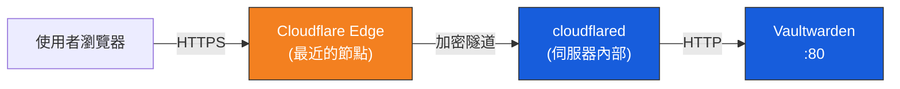

# Cloudflare Tunnel 設定教學

Cloudflare Tunnel（前身 Argo Tunnel）能在不對外暴露伺服器 IP、不開放防火牆連接埠的前提下，將內網服務安全發佈到網際網路上。本文件說明如何在 Cloudflare 平台建立 Tunnel 並取得 `CLOUDFLARE_TUNNEL_TOKEN`。

## 運作原理



> **核心優勢**：伺服器無須開放任何 inbound Port，所有連線皆由 `cloudflared` 主動向外建立。

## 事前準備

- 一個已在 Cloudflare 上託管（NS 指向 Cloudflare）的域名
- Cloudflare 帳號

---

## 步驟一：啟用 Zero Trust

若尚未啟用 Cloudflare Zero Trust，請前往 [Zero Trust 儀表板](https://one.dash.cloudflare.com/)：

1. 依照畫面引導選擇 **Free Plan**（免費方案，無須付費）。
2. 綁定付款資訊（免費方案不會產生扣款）。
3. 設定專屬的 Team Name。

## 步驟二：建立 Tunnel

1. 進入 Zero Trust 儀表板 → 左側選單 → **Networks > Tunnels**。
2. 點擊 **Create a tunnel**。
3. 選擇 **Cloudflared** 作為 Connector Type。
4. 為此 Tunnel 命名（例如 `Bitwarden-Home`），點選 **Save tunnel**。

## 步驟三：取得 Tunnel Token

建立完成後會進入 **Install and run a connector** 頁面：

1. 環境選擇 **Docker**。
2. 頁面將顯示類似以下指令：
   ```bash
   docker run cloudflare/cloudflared:latest tunnel --no-autoupdate run --token eyJhbGciOiJIUzI1NiIsInR5cCI6IkpXVCJ9...
   ```
3. 複製 `--token` 後方的完整字串，即為 `CLOUDFLARE_TUNNEL_TOKEN`。
4. 將此 Token 填入 `.env` 檔案：
   ```env
   CLOUDFLARE_TUNNEL_TOKEN=eyJhbGciOiJIUzI...(完整 Token)
   ```

> ⚠️ Token 等同於隧道的存取金鑰，請**絕對不要**將其提交至公開的版本控制系統。

## 步驟四：設定 Public Hostname

繼續在 Tunnel 設定頁面點選 **Next**，進入 **Route Traffic > Public Hostnames**：

1. **Subdomain**：填入子域名，例如 `vault`。
2. **Domain**：選擇已託管在 Cloudflare 上的主域名，例如 `example.com`。
   - 組合後的對外網址為：`https://vault.example.com`
3. **Service** 區段：
   - **Type**：`HTTP`
   - **URL**：`bitwarden:80`
     > 此處使用 Docker Compose 中 Vaultwarden 服務的容器名稱（`bitwarden`）與內部 Port（`80`）。由於 `cloudflared` 與 `bitwarden` 位於同一 Docker 網路 `bw_net`，可直接透過 Service Name 互通。
4. 點擊 **Save tunnel** 完成設定。

## 進階安全設定（選用）

在 Cloudflare Zero Trust 儀表板中，可額外啟用以下安全功能：

| 功能 | 說明 |
|------|------|
| **Access Policy** | 限制特定 Email / IP 範圍才能存取（適合企業環境） |
| **Bot Management** | 防止自動化攻擊 |
| **WAF 自訂規則** | 針對 `/admin` 路徑設定更嚴格的存取控制 |

---

| | 下一步 |
|--|--------|
| | [伺服器 Docker 部署](deployment.md) |
