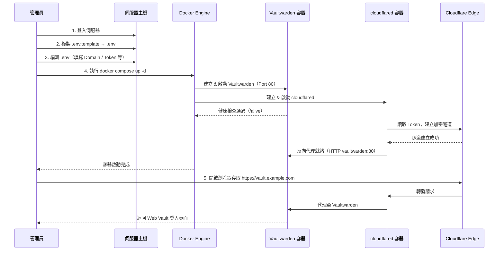
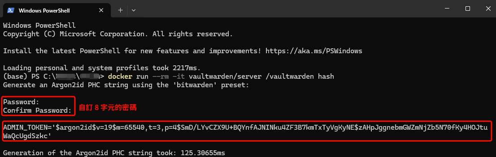

# Vaultwarden（社群版）部署步驟

本文件說明如何透過 Docker Compose 部署 Vaultwarden（Bitwarden 相容伺服器）與 Cloudflare Tunnel 反向代理服務。此為本專案的**預設推薦方案**。

> Vaultwarden 為社群維護的第三方 Bitwarden 相容伺服器（[GitHub](https://github.com/dani-garcia/vaultwarden)），使用 Rust 開發，全功能免費。
> 相關設定檔位於專案根目錄，官方完整變數參考位於 `vaultwarden/.env.template`。

## 部署流程圖



## 系統需求

| 項目 | 最低要求 | DS224+ |
|------|----------|--------|
| CPU | x64 / ARM64 架構 | ✅ Intel J4125 |
| 記憶體 | ≥ 512 MB（實際佔用約 150 MB） | ✅ 2 GB |
| 硬碟空間 | ≥ 1 GB | ✅ |
| Docker | Engine 20.10+ / Compose V2 | ✅ Synology Container Manager |
| 資料庫 | SQLite（內建預設） | ✅ |

---

## 步驟一：確認目錄結構

確認專案根目錄內包含以下檔案：

```
bitwarden-server/
├── docker-compose.yml
├── .env.template
└── .gitignore
```

## 步驟二：建立持久化資料目錄

```bash
mkdir -p bw-data
```

> ⚠️ **NAS 部署注意事項**：群暉 DSM 的 Container Manager 不會自動建立 bind mount 目錄。
> 若未事先建立 `bw-data/`，容器啟動時可能報錯或產生權限問題。
> 建議透過 SSH 或 File Station 手動建立該目錄。

## 步驟三：環境變數設定

1. 從範本建立實際的設定檔：
   ```bash
   cp .env.template .env
   ```

2. 編輯 `.env`，**至少**填入以下必填參數：

   | 變數名稱 | 必填 | 說明 |
   |----------|:----:|------|
   | `DOMAIN` | ✅ | 外部存取 URL（**含** `https://` 前綴），例如 `https://vault.example.com` |
   | `CLOUDFLARE_TUNNEL_TOKEN` | ✅ | Cloudflare Tunnel 驗證 Token（[取得方式](cloudflare-tunnel.md)） |
   | `ADMIN_TOKEN` | ✅ | Admin 面板驗證 Token |
   | `SIGNUPS_ALLOWED` | — | 預設 `true`；完成管理者帳號註冊後建議改為 `false` |
   | `SMTP_*` | — | SMTP 郵件設定（選填但強烈建議） |

   > `.env.template` 內已涵蓋所有可用設定的中文說明，包含推播通知、SSO、2FA、排程工作等進階設定。

3. **產生 Admin Token**（二選一）：

   方法 A：Argon2 PHC（推薦，直接在電腦終端機運行）
   
   ```bash
   docker run --rm -it vaultwarden/server /vaultwarden hash
   ```

   範例：
   
   > ⚠️ 將產生的字串填入 `ADMIN_TOKEN` 時，需將所有 `$` 替換為 `$$`。

   方法 B：隨機字串
   
   ```bash
   openssl rand -base64 128
   ```

   > ⚠️ `.env` 內含機敏資訊，已透過 `.gitignore` 排除於版控之外。

## 步驟四：啟動容器

```bash
docker compose up -d
```

> 首次啟動會從 Docker Hub 拉取 `vaultwarden/server` 及 `cloudflare/cloudflared` 映像檔。

確認容器運行狀態：

```bash
docker compose ps
```

預期輸出中 `vaultwarden` 與 `cloudflared_bw` 的 Status 均為 `Up (healthy)`。

查看即時日誌：

```bash
docker compose logs -f
```

## 步驟五：驗證連線

開啟瀏覽器，前往設定好的域名（例如 `https://vault.example.com`）。

若能正常看到 Bitwarden Web Vault 登入/註冊畫面，代表部署成功。

## 步驟六：建立管理者帳號與安全封鎖

1. 在 Web Vault 畫面點選「建立帳號」。
2. 輸入電子郵件與主控密碼（Master Password）完成註冊。
3. **完成註冊後，立即執行以下安全封鎖：**

   編輯 `.env`，修改：
   ```env
   SIGNUPS_ALLOWED=false
   ```

   重新建立容器使設定生效：
   ```bash
   docker compose down && docker compose up -d
   ```

4. **（選填）啟用登入速率防護（Rate Limiting）：**
   若希望抵禦密碼暴力破解，可於 `.env` 取消註解 `LOGIN_RATELIMIT_*` 與 `ADMIN_RATELIMIT_*`。
   > ☠️ **致命陷阱警告**：在 Cloudflare Tunnel 架構下，你**必須**同時配置 `IP_HEADER=X-Forwarded-For`。否則 Vaultwarden 只能看見內部 Docker IP 的請求，只要任何人觸發一次防護（例如連續輸錯 10 次），**全站所有使用者都會被封鎖**！

5. **（選填）驗證 Admin 面板：** 前往 `https://vault.example.com/admin`，輸入 Admin Token 登入。

## 步驟七：選填 — 啟用行動裝置推撥通知

啟用後行動裝置可即時同步密碼庫變更（無須手動下拉更新）。

1. 前往 [https://bitwarden.com/host/](https://bitwarden.com/host/) 取得 Installation ID 與 Key。
2. 在 `.env` 中啟用：
   ```env
   PUSH_ENABLED=true
   PUSH_INSTALLATION_ID=填入取得的 ID
   PUSH_INSTALLATION_KEY=填入取得的 Key
   ```
3. 重啟容器：
   ```bash
   docker compose down && docker compose up -d
   ```

## 步驟八：選填 — 配置 SMTP 發信服務 (以 Gmail 為例)

配置 SMTP 後，Vaultwarden 才能夠寄送邀請信、新登入提示或 Email 2FA 驗證碼。若你使用個人的 Gmail 信箱：

1. **取得 Google 應用程式密碼：**
   - 前往 [Google 帳戶安全性](https://myaccount.google.com/security)，確認已開啟「兩步驟驗證」。
   - 搜尋並點選「應用程式密碼 (App Passwords)」。
   - 建立並取得一組 **16 碼** 的隨機密碼。

2. **編輯 `.env` 中的 SMTP 設定：**
   取消註解並填入以下內容：
   ```env
   SMTP_HOST=smtp.gmail.com
   SMTP_FROM=your_email@gmail.com
   SMTP_FROM_NAME=Vaultwarden
   SMTP_PORT=587
   SMTP_SECURITY=starttls
   SMTP_USERNAME=your_email@gmail.com
   # ⚠️ 請填寫剛剛獲得的 16 碼應用程式密碼，不可使用原本的 Google 密碼
   SMTP_PASSWORD=xxxx xxxx xxxx xxxx
   ```

3. **重啟容器使其生效：**
   ```bash
   docker compose down && docker compose up -d
   ```

> ⚠️ **Google SMTP 限制與權衡：**
> 
> 1. **寄件者覆寫**：無論 `SMTP_FROM` 填寫什麼，Google 皆會強制替換成你實際發信的 `your_email@gmail.com`。若極度在意企業/品牌形象，建議改用 SendGrid、Resend 或 Mailgun 等專業第三方 API 發信服務。
> 2. **發信額度與封鎖風險**：免費版 Gmail 每天發信上限極低（約 500 封）。若遭惡意機器人大量觸發發信要求（例如狂洗密碼重置或邀請），可能導致你的 Google 帳號因大量異常發信而被判定為垃圾郵件帳號。**請務必確保前面的防暴破機率設定（Rate Limiting）與 Cloudflare WAF 皆已啟動防禦。**

## Cloudflare Tunnel 注意事項

在 Cloudflare Tunnel 設定 Public Hostname 時：

- **Type**：`HTTP`
- **URL**：`vaultwarden:80`

> ⚠️ 此處的 `vaultwarden` 為 Docker Compose 中的 Service Name。
> 與其他方案不同：Lite 使用 `bitwarden:8080`，標準版使用 `bitwarden-nginx:8080`。

## 常用維護指令

| 操作 | 指令 |
|------|------|
| 查看狀態 | `docker compose ps` |
| 查看日誌 | `docker compose logs -f vaultwarden` |
| 更新映像 | `docker compose pull && docker compose up -d` |
| 停止服務 | `docker compose down` |
| 備份資料 | `cp -r bw-data/ bw-data-backup-$(date +%Y%m%d)/` |

---

| 上一步 | 下一步 |
|--------|--------|
| [Cloudflare Tunnel 設定](cloudflare-tunnel.md) | [安全注意事項](precautions.md) |
