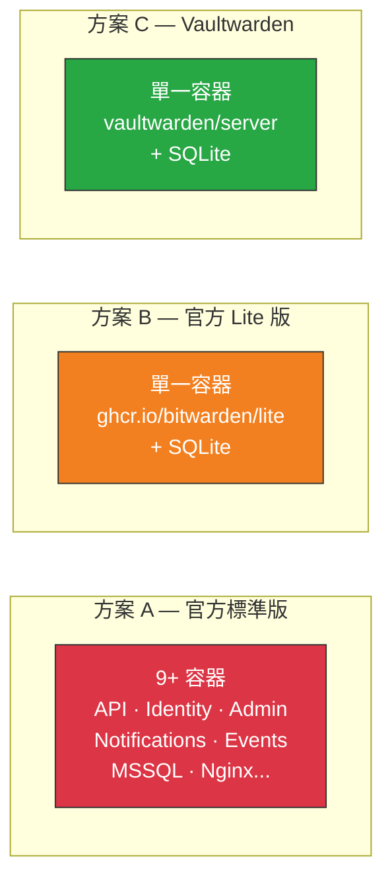
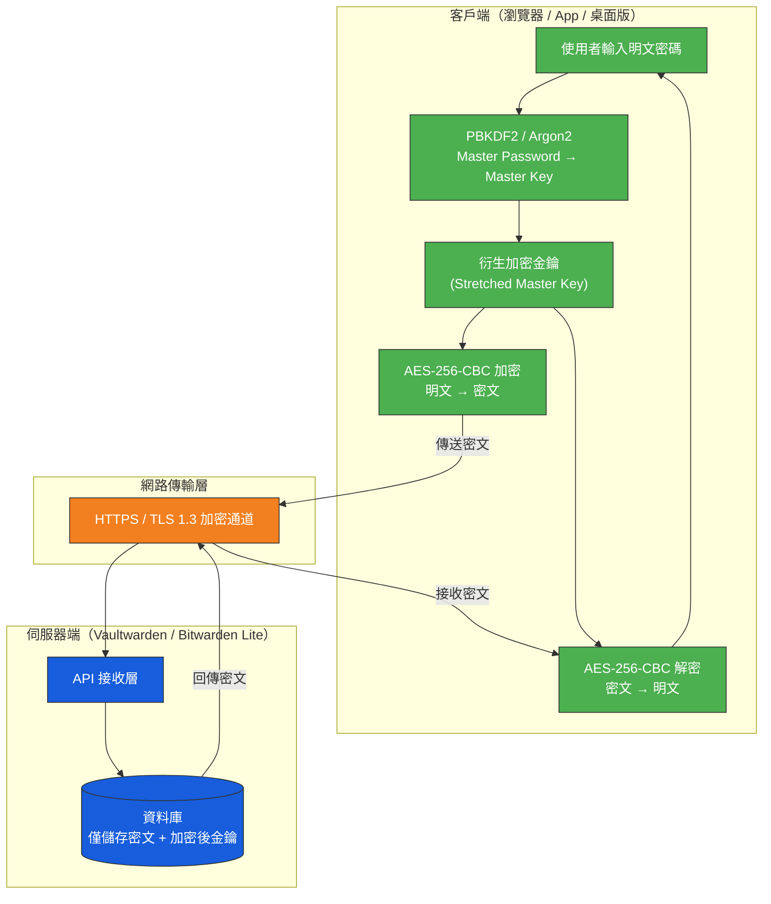

# 方案評估與硬體分析

本文件針對部署環境（Synology DS224+ NAS）的硬體限制，比較三種 Bitwarden 自建部署方案的適用性與安全性考量。

## 部署環境：Synology DS224+

| 規格項目 | 數值 |
|----------|------|
| CPU | Intel Celeron J4125 四核心（2.0 GHz，Burst 2.7 GHz） |
| 架構 | x86_64 (amd64) |
| 預設記憶體 | 2 GB DDR4（焊死） |
| 最大記憶體 | 6 GB（加裝一條 4 GB DDR4 SO-DIMM） |
| 儲存 | 2-Bay（3.5" / 2.5" SATA HDD/SSD） |
| 網路 | 2 × 1GbE RJ-45（支援 Link Aggregation） |
| 功耗 | ~15W |

---

## 三種部署方案比較

| 比較項目 | 方案 A：官方標準版 | 方案 B：官方 Lite 版 | 方案 C：Vaultwarden |
|----------|-------------------|---------------------|---------------------|
| **映像來源** | GHCR（9+ 容器） | `ghcr.io/bitwarden/lite` | `vaultwarden/server` |
| **容器數量** | 9+ 個微服務 | 1 個 | 1 個 |
| **最低記憶體** | 4 GB | 200 MB | ~150 MB |
| **資料庫** | MSSQL Express（必要） | SQLite / MySQL / PostgreSQL | SQLite / MySQL / PostgreSQL |
| **磁碟空間** | ≥ 12 GB | ≥ 1 GB | ≥ 1 GB |
| **開發語言** | C# / .NET | C# / .NET | Rust |
| **維護方** | Bitwarden Inc. 官方 | Bitwarden Inc. 官方 | 社群（dani-garcia） |
| **客戶端相容** | 原生 | 原生 | 完全相容 |
| **需要 Installation ID** | ✅ | ✅ | ❌ |
| **官方安全稽核** | ✅ HackerOne | ✅（共用程式碼基底） | ❌ 社群審查 |
| **免費功能範圍** | 部分付費 | 部分付費 | 全功能免費 |

---

## DS224+ 適用性分析

### ❌ 方案 A：官方標準版 — 不適用

- 最低記憶體需求 4 GB，DS224+ 預設僅 2 GB
- 即使擴充至 6 GB，MSSQL Express + 9 容器的資源佔用將嚴重影響 NAS 本身的功能運作
- 官方部署工具 `bitwarden.sh` 針對完整 Linux 設計，在 DSM 容器環境中無法直接使用

### ✅ 方案 B：官方 Lite 版 — 適用（推薦做為「官方方案」選項）

- 最低記憶體需求僅 200 MB，DS224+ 完全能負擔
- 單一容器，搭配 SQLite 無須額外資料庫服務
- 由 Bitwarden Inc. 官方維護，共享官方程式碼基底與安全修補
- 需要到 [bitwarden.com/host](https://bitwarden.com/host/) 申請 Installation ID/Key

### ✅ 方案 C：Vaultwarden — 適用（推薦做為「輕量方案」選項）

- 記憶體佔用最低（~150 MB），適合資源極度受限的環境
- 免申請 Installation ID，部署最為簡便
- 全功能免費（包含 TOTP、Send、Organizations 等官方付費功能）
- 由社群維護，安全修補速度依賴社群開發者

---

## 安全性深度分析

### Bitwarden 加密與資料流向

### 核心安全原則

> **零知識架構（Zero-Knowledge）**：伺服器端永遠不會接觸到明文密碼或未加密的金鑰。所有加解密作業完全在客戶端完成。即使伺服器被入侵，攻擊者取得的僅為無法解密的密文。

| 安全層面 | 說明 |
|----------|------|
| **密碼衍生** | Master Password 經由 PBKDF2-SHA256（預設 600,000 次迭代）或 Argon2id 衍生出 Master Key |
| **對稱加密** | 密碼庫項目以 AES-256-CBC + HMAC-SHA256 加密 |
| **傳輸加密** | 所有客戶端與伺服器之間的通訊透過 TLS 加密 |
| **伺服器儲存** | 資料庫僅存放密文、加密後的對稱金鑰、雜湊過的認證資料 |
| **Master Password** | 從不傳送至伺服器——僅傳送其雜湊值用於認證 |

### 伺服器端真正的安全風險

由於採用零知識架構，伺服器端的安全風險**並非**密碼洩漏，而是：

| 風險類型 | 說明 | 緩解措施 |
|----------|------|----------|
| 未授權存取 | 攻擊者透過暴力破解或憑證填充取得帳號 | 啟用 2FA、設定強 Master Password |
| 服務中斷 | DDoS 或伺服器當機導致無法存取密碼庫 | Cloudflare Tunnel 提供 DDoS 防護 + 客戶端有離線快取 |
| 供應鏈攻擊 | 惡意映像檔注入後門 | 僅使用官方 GHCR 映像或 Vaultwarden 官方 Docker Hub 映像 |
| 資料遺失 | 硬碟損壞且無備份 | 定期備份 `bw-data/` 至異地 |

---

## 結論與建議

針對 Synology DS224+（2 GB / 6 GB RAM）的使用場景：

| 需求傾向 | 建議方案 | 所在目錄 |
|----------|----------|----------|
| 追求官方維護與品牌信任 | **方案 B：Bitwarden Lite** | `lite/` |
| 追求輕量、全功能免費、最快部署 | **方案 C：Vaultwarden** | 專案根目錄 |

> 兩套方案共用相同的 Cloudflare Tunnel 設定（`cloudflared` 容器）與客戶端設定流程。

---

| | 下一步 |
|--|--------|
| 選擇 Vaultwarden | [Vaultwarden 部署步驟](deployment.md) |
| 選擇 Bitwarden Lite（官方） | [Bitwarden Lite 部署步驟](lite-deployment.md) |
