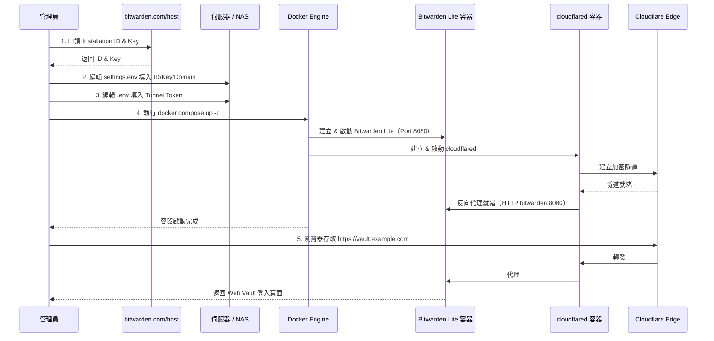

# Bitwarden Lite（官方）部署步驟

本文件說明如何透過 Docker Compose 部署官方 Bitwarden Lite（前身為 Bitwarden Unified），搭配 Cloudflare Tunnel 反向代理。此為本專案的**預設部署方案**。

> Bitwarden Lite 屬於官方維護的單一容器輕量版，映像來源為 GitHub Container Registry (`ghcr.io/bitwarden/lite`)。

## 部署流程圖



## 系統需求

| 項目 | 最低要求 | DS224+ |
|------|----------|--------|
| CPU | x64 架構 | ✅ Intel J4125 |
| 記憶體 | ≥ 200 MB | ✅ 2 GB（可用） |
| 儲存空間 | ≥ 1 GB | ✅ |
| Docker | Engine 26+ | ✅ Synology Container Manager |
| 資料庫 | SQLite（內建） | ✅ 無須額外安裝 |

---

## 步驟一：取得 Installation ID & Key

1. 前往 [https://bitwarden.com/host/](https://bitwarden.com/host/)。
2. 輸入電子郵件地址後提交。
3. 頁面將即時產生 **Installation ID** 與 **Installation Key**，複製並保存。

> ⚠️ 這組 ID/Key 為免費取得，用於向 Bitwarden 雲端推播服務驗證身份。請妥善保管。

## 步驟二：建立持久化資料目錄

```bash
cd lite/
mkdir -p bw-data
```

> ⚠️ **NAS 部署注意事項**：群暉 DSM 的 Container Manager 不會自動建立 bind mount 目錄。
> 若未事先建立 `bw-data/`，容器啟動時可能報錯或產生權限問題。
> 建議透過 SSH 或 File Station 手動建立該目錄。

## 步驟三：配置 settings.env

編輯 `lite/` 目錄下的 `settings.env`，填入必要參數：

| 變數名稱 | 必填 | 說明 |
|----------|:----:|------|
| `BW_DOMAIN` | ✅ | 對外存取域名（不含 `https://`），例如 `vault.example.com` |
| `BW_DB_PROVIDER` | ✅ | 資料庫類型，建議 NAS 環境使用 `sqlite` |
| `BW_INSTALLATION_ID` | ✅ | 從 bitwarden.com/host 取得 |
| `BW_INSTALLATION_KEY` | ✅ | 從 bitwarden.com/host 取得 |
| `globalSettings__mail__smtp__*` | — | SMTP 設定（選填但建議配置） |

## 步驟四：配置 .env（Cloudflare Tunnel Token）

```bash
cp .env.template .env
```

編輯 `.env`，填入 Cloudflare Tunnel Token（[取得方式](cloudflare-tunnel.md)）。

## 步驟五：啟動容器

```bash
cd lite/
docker compose up -d
```

確認容器運行狀態：

```bash
docker compose ps
```

預期輸出中 `bitwarden` 與 `cloudflared_bw` 兩個容器均為 `Up` 狀態。

## 步驟六：驗證連線與註冊

1. 開啟瀏覽器，前往 `https://vault.example.com`。
2. 正常顯示 Bitwarden Web Vault 登入頁面即代表部署成功。
3. 點選「建立帳號」完成管理者帳號註冊。

> 若無法連線，檢查容器日誌：
> ```bash
> docker compose logs -f
> ```

## Cloudflare Tunnel 注意事項

由於 Bitwarden Lite 的內部 HTTP Port 為 `8080`（非預設的 80），在 Cloudflare Tunnel 設定 Public Hostname 時：

- **Type**：`HTTP`
- **URL**：`bitwarden:8080`

此處與 Vaultwarden 方案不同（Vaultwarden 使用 `bitwarden:80`）。

## 與 Vaultwarden 方案的差異對照

| 項目 | Bitwarden Lite（本方案） | Vaultwarden（根目錄預設方案） |
|------|-------------------------|----------------------------------|
| 映像 | `ghcr.io/bitwarden/lite` | `vaultwarden/server` |
| 內部 Port | 8080 | 80 |
| 資料掛載路徑 | `/etc/bitwarden` | `/data` |
| 需要 Installation ID | ✅ | ❌ |
| Admin 面板 | 內建（BW_ENABLE_ADMIN） | 需設定 ADMIN_TOKEN |
| Tunnel URL 設定 | `bitwarden:8080` | `bitwarden:80` |

---

| 上一步 | 下一步 |
|--------|--------|
| [Cloudflare Tunnel 設定](cloudflare-tunnel.md) | [安全注意事項](precautions.md) |
