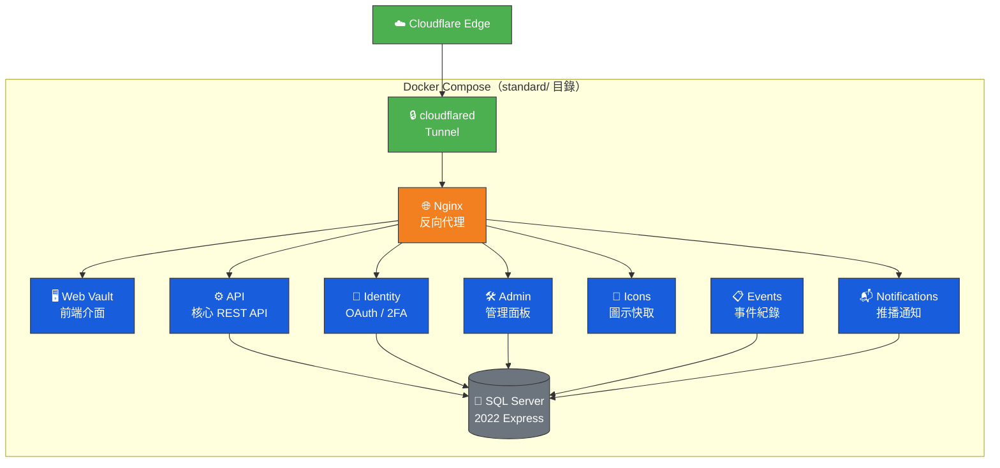

# Bitwarden 官方標準版部署步驟

本文件說明如何透過 Docker Compose 部署官方 Bitwarden Server 完整版（9+ 微服務架構），搭配 Cloudflare Tunnel 反向代理。

> ⚠️ **硬體需求警告**：此方案最低需要 **4 GB RAM** 與 **12 GB 磁碟空間**。Synology DS224+（2 GB / 6 GB）在擴充記憶體後勉強可運行，但將大幅影響 NAS 其他功能。**建議優先選擇根目錄的 Bitwarden Lite 方案。**

## 架構圖



## 系統需求

| 項目 | 最低要求 | DS224+（擴充後） |
|------|----------|------------------|
| CPU | x64 雙核心 2GHz | ⚠️ J4125 勉強 |
| 記憶體 | 4 GB | ⚠️ 最大 6 GB（需擴充） |
| 儲存空間 | ≥ 12 GB | ✅ |
| Docker | Engine 26+ | ✅ |
| 資料庫 | SQL Server 2022（容器內建） | ✅ |

---

## 步驟一：取得 Installation ID & Key

1. 前往 [https://bitwarden.com/host/](https://bitwarden.com/host/)
2. 輸入電子郵件地址後提交
3. 複製產生的 **Installation ID** 與 **Installation Key**

## 步驟二：建立持久化資料目錄

> ⚠️ **NAS 部署注意事項**：群暉 DSM 的 Container Manager 不會自動建立 bind mount 目錄。
> 此方案使用 Docker Named Volumes，一般無需手動建立。但若在 NAS 上遇到權限問題，請確認 Docker 共享資料夾設定正確。

## 步驟三：配置環境變數

```bash
cd standard/
cp .env.template .env
```

### .env 設定

| 變數名稱 | 必填 | 說明 |
|----------|:----:|------|
| `MSSQL_SA_PASSWORD` | ✅ | SQL Server SA 密碼（需符合複雜度要求） |
| `CLOUDFLARE_TUNNEL_TOKEN` | ✅ | Cloudflare Tunnel Token |
| `BW_VERSION` | — | 映像版本鎖定（預設 `latest`） |

### settings.env 設定

| 變數名稱 | 必填 | 說明 |
|----------|:----:|------|
| `globalSettings__installation__id` | ✅ | Installation ID |
| `globalSettings__installation__key` | ✅ | Installation Key |
| `globalSettings__sqlServer__connectionString` | ✅ | 資料庫連線字串（密碼須與 .env 一致） |
| `globalSettings__baseServiceUri__vault` | ✅ | 外部存取 URL |
| `globalSettings__mail__smtp__*` | — | SMTP 設定 |

> ⚠️ `settings.env` 中的 SQL 連線字串密碼必須與 `.env` 中的 `MSSQL_SA_PASSWORD` 完全一致。

## 步驟四：啟動容器

```bash
docker compose up -d
```

> 首次啟動會從 GHCR 拉取 10 個映像（約 2-3 GB），耗時取決於網路速度。

確認所有容器運行正常：

```bash
docker compose ps
```

預期 10 個容器全部為 `Up` 狀態。SQL Server 啟動較慢，相依服務可能需等待 30-60 秒。

## 步驟五：驗證連線

前往 `https://vault.example.com`，正常顯示 Web Vault 即代表部署成功。

## Cloudflare Tunnel 注意事項

在 Cloudflare Tunnel 設定 Public Hostname 時：

- **Type**：`HTTP`
- **URL**：`bitwarden-nginx:8080`

此處指向 Nginx 容器（所有服務的統一入口）。

## 三套方案 Port 對照

| 方案 | Tunnel 目標 |
|------|-------------|
| 標準版（本方案） | `bitwarden-nginx:8080` |
| Bitwarden Lite（`lite/`） | `bitwarden:8080` |
| Vaultwarden（根目錄預設方案） | `bitwarden:80` |

---

| 上一步 | 下一步 |
|--------|--------|
| [Cloudflare Tunnel 設定](cloudflare-tunnel.md) | [安全注意事項](precautions.md) |
